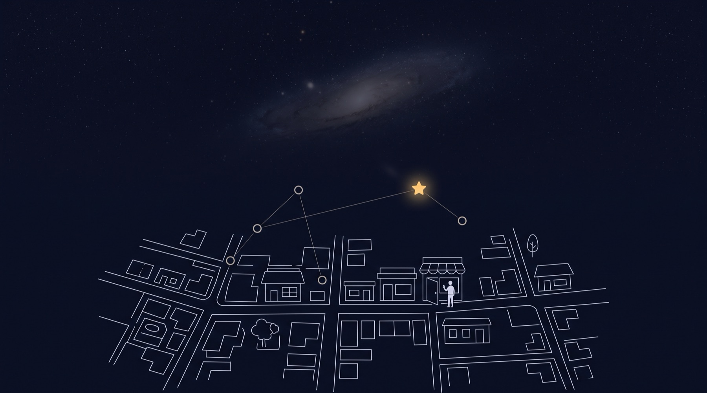
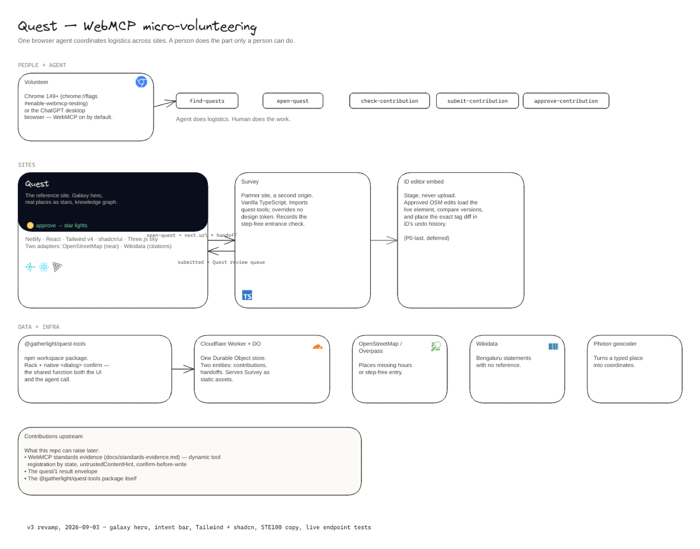

# GatherLight (Quest)



Turn twenty free minutes into one checked fix for your community's map. One browser agent runs the logistics across sites. A person does the part only a person can do.

Built for The WebMCP Challenge, September 2026. MIT.

**Live:** Quest at https://gatherlight.netlify.app · store and partner site at https://quest-store.quest-store.workers.dev · package `@gatherlight/quest-tools` in `packages/quest-tools` · [architecture board on Excalidraw](https://link.excalidraw.com/p/readonly/lX8oa1Na6l5lssJpnOWL).

## One line

Five verbs, one import. A site that adopts `@gatherlight/quest-tools` becomes agent-ready for volunteering. The agent finds, opens, checks, and submits. The human gathers the evidence and confirms every consequential action.

## Why WebMCP is load-bearing here

WebMCP lets a page hand tools to the agent that is already in the browser. GatherLight leans on the parts of that API most demos skip.

| WebMCP capability | How GatherLight uses it | Where |
|---|---|---|
| `document.modelContext.registerTool` | Five tools, one package, two unrelated sites | `packages/quest-tools/src/controller.ts` |
| Dynamic registration | `available()` decides per verb on every state change. `submit-contribution` exists only after `check-contribution` passes. The rack shows the exact list an agent sees. | `controller.ts` refresh(), `src/webmcp/tools.ts` available() |
| Long-running `execute` | `submit-contribution` opens a native `<dialog>` and waits up to 90 s for a human click inside the tool call. Decline, timeout, cancel, stale data, and validation each return a distinct result. | `controller.ts` run(), `ui/confirm-dialog.ts` |
| `untrustedContentHint` and `readOnlyHint` | Set on every tool. External titles are capped and escaped. | `controller.ts` register() |
| Cross-document continuation | Tools die on navigation, so `open-quest` never navigates. It returns `next.url` plus a single-use handoff. The agent walks to a second origin, which exchanges the handoff and registers its own tools. | `src/webmcp/tools.ts` open, `survey/main.ts` boot |
| Machine-readable results | Every tool ends with one line: `quest/1 {"ok":…,"state":…,"next":{…}}`. Agents plan on that line, not on prose. Output capped at 1,500 characters. | `packages/quest-tools/src/envelope.ts` |
| Manual mode parity | Every tool is a thin wrapper over a function the page's own buttons call. Without an agent, the same code runs from clicks and the same dialog gates the send. | `controller.run(verb, input, { viaUi: true })` |

Runtime observations from Chrome 152 (`execute` gets one argument, unregister-during-execute drops the result, agents that cache `getTools()` miss late registrations) and three drafted comments on open WebMCP issues (#165 confirmation, #161 task grammars, #227 cross-document) are in [`docs/standards-evidence.md`](docs/standards-evidence.md).

## Architecture



Editable source: [`docs/quest-architecture.excalidraw`](docs/quest-architecture.excalidraw). Live board with the full walkthrough: [Excalidraw (read-only)](https://link.excalidraw.com/p/readonly/lX8oa1Na6l5lssJpnOWL).

```
Volunteer + agent (Chrome 149+ with WebMCP, or the ChatGPT desktop browser)
   │  find-quests · open-quest · check-contribution · submit-contribution · approve-contribution
   ▼
Quest  (React 19, Vite 8, Tailwind v4, shadcn/ui, Three.js)  ──open-quest→ next.url + handoff──▶  Survey (vanilla TS, second origin)
   │  imports @gatherlight/quest-tools                                                           │  imports the same package
   ▼                                                                                             ▼
Cloudflare Worker + Durable Object  (contributions, handoffs)  ◀── submit · approve ── both sites
   │
   ├── OpenStreetMap via Overpass (gaps: no opening_hours, no wheelchair)
   ├── Wikidata via SPARQL (statements with no reference)
   ├── Nominatim (agent's `near`), Photon (search as you type), opening_hours (validation)
   └── iD editor embed: stages an approved OSM edit, never uploads
```

### Parts

| Part | Path | Lines | What it owns |
|---|---|---|---|
| Package | `packages/quest-tools` | ~520 | Tool names and budgets, the ten-state envelope, registration by state, the check → confirm → check → submit order, one pending confirmation per page, deferred abort, the rack renderer, the native `<dialog>` confirm. Framework-neutral. One dependency (`@mcp-b/webmcp-types`). |
| Quest | `src/` | | Reference site. Two adapters (OSM, Wikidata), the sky (real places as stars in WebGL, SVG fallback), the knowledge graph, the review queue, the intent bar. |
| Survey | `survey/` | ~220 | Partner site on a second origin. Receives a handoff, records a step-free entrance check. Overrides no design token. The proof the grammar travels. |
| Store | `worker/` | ~380 | One Durable Object, two entities. Handoffs are hashed, origin-bound, single-use, five minutes. Exchanging one yields a grant scoped to that contribution, never the volunteer's session. Submitted rows are frozen. Self-review refused. Unknown browser origins get 403. Serves Survey as static assets. |

### The five tools

| Tool | Registered when | Job |
|---|---|---|
| `find-quests` | Always | Match quests to minutes, skills, and place. Returns ids. |
| `open-quest` | Always | Open one quest. For a step-free entry quest, return `next.url` and a `handoff`. |
| `check-contribution` | A quest is open on this origin | Validate the form. Say exactly what to fix. |
| `submit-contribution` | Check passed | Confirm dialog, wait for the click, re-check, send. |
| `approve-contribution` | Reviewer tab, queue not empty | Approve one submission. Conflict-checked against the live OSM element version. |

States: `available open invalid checked declined submitted approved rejected stale landed`. `approved` never claims the public record changed. Only `landed` does, and nothing lands in this release.

No tool argument accepts the volunteer's evidence. The agent opens, checks, routes, and submits. The person fills the visible form.

## How it is engineered

- **Shared function, two callers.** Each verb is one function. The agent calls it through WebMCP. The button calls it through `controller.run`. There is no second code path, so the confirm gate cannot be skipped from either side.
- **Check twice.** Submit runs check, opens the dialog with the exact preview, waits, runs check again, deep-compares the two previews, then sends. If the form changed after you confirmed, nothing is sent.
- **Registration is data.** A site returns `true`, `{ locked: reason }`, or nothing per verb. The rack draws what it is given. Locked tools show their reason to people and stay hidden from agents.
- **Handoff, not shared session.** The second origin never sees the first origin's credentials. It exchanges a token for canonical state and a narrow grant.
- **Honest artifacts.** A star is a real coordinate. A graph edge is a real Wikidata claim. Approved marks stay outlined. No karma, streak, or rank exists.
- **Budgets enforced in code.** Names under 30 characters, descriptions under 500, parameter descriptions under 150, output under 1,500. The contract test fails if any tool breaks them.
- **Offline fallback.** Bundled JSON for the default place, so a blocked Overpass or SPARQL endpoint does not empty the demo. The UI says which source it used.
- **Design system in the package, skin in the site.** The rack and dialog ship with `--qt-*` tokens and a defensive reset. Quest maps its palette onto them with `light-dark()` tokens. Survey links the stylesheet and changes nothing.

Stack: React 19, Vite 8, TypeScript 6, Tailwind v4, shadcn/ui (Radix, cmdk, vaul, Sonner), Three.js, `opening_hours`, Cloudflare Workers + Durable Objects, Netlify. No state library, no router, no ORM.

## Run it locally

```
npm install
npm run dev:store      # Durable Object store + Survey on http://localhost:8787
npm run dev            # Quest on http://localhost:5173
```

Survey needs a build to be served by the store: `npm run build:survey`. Survey's own dev server: `npm run dev:survey` (http://localhost:5174).

Open Quest in a WebMCP runtime:

- Chrome 149 or newer: enable `chrome://flags/#enable-webmcp-testing` and relaunch, or launch with `--enable-features=WebMCP`.
- ChatGPT desktop app browser: WebMCP is on by default.

Without WebMCP everything runs in manual mode. The rack says `No agent connected. Click the buttons instead.`

Open `/?role=reviewer` in a second tab to review. The reviewer tab uses a separate anonymous session so the two-tab demo works in one browser. This is a demo compromise: one browser can approve its own work. Reviewer sign-in by OpenStreetMap or Wikimedia is next.

## Test

```
npm run test:contract              # package: names, budgets, registration by state, envelope, confirm order, cancellation (13 tests)
node worker/test/smoke.mjs [url]   # store: ownership, grants, handoff origin/single-use/expiry, self-review, url checks
npm run build && npm run build:survey
npx vite preview --port 4173 & npm run test:e2e   # real Chrome, WebMCP on, 44 checks through document.modelContext across Quest, Survey, and iD
npm run test:live [questUrl] [storeUrl]           # deployed endpoints: Quest, Survey, store origin rules, url check (9 checks)
```

The e2e run drives `document.modelContext.executeTool` directly. It proves: fresh load registers two tools; open adds check; check fails on an empty form and passes on a filled one; submit waits for the click and never sends without it; the reviewer tab registers approve only; approval lights a star in the volunteer tab; `open-quest` returns a Survey URL; Survey registers check only; a handoff is single use (410 on reuse); an approved edit stages in iD without uploading; the Wikidata path renders a graph edge; `near` geocodes and moves the sky.

Before a push, the diff gets an independent review from [OpenAI Codex](https://github.com/openai/codex) in a read-only sandbox. Blockers are fixed before the commit. The commit trailer records the review.

## Deploy

Quest deploys to Netlify from `main` (`netlify.toml`). Environment: `VITE_STORE_URL` and `VITE_SURVEY_URL` point at the Worker origin.

The store and Survey deploy as one Worker from `.github/workflows/worker.yml` on push, with secret `CLOUDFLARE_API_TOKEN` and variable `QUEST_URL`. By hand:

```
VITE_QUEST_URL=https://gatherlight.netlify.app/ npm run build:survey
cd worker && npx wrangler deploy
```

Quest's origin is in `ALLOWED_ORIGINS` in `worker/wrangler.toml`. Add any other origin you serve Quest from.

## What is not done

- No write-back. Approved OSM edits stage in iD; a person uploads. Wikidata references are held, not written.
- Reviewer identity is a first name in a text field.
- Quests cover three kinds: opening hours, step-free entry, missing source. The adapters are small on purpose.
- The confirm dialog is site-enforced. A hostile page could skip it. The browser should own this; the requirements are written up in `docs/standards-evidence.md`.

## Docs

- [`SPEC.md`](SPEC.md): the protocol, the five verbs, the envelope, the test plan.
- [`DESIGN.md`](DESIGN.md): the two surfaces, the token contract, motion, copy rules.
- [`docs/standards-evidence.md`](docs/standards-evidence.md): runtime observations and drafted standards comments.
- [`packages/quest-tools/README.md`](packages/quest-tools/README.md): adopting the package on your own site.

## Data and licences

Place data © OpenStreetMap contributors, ODbL. Wikidata content CC0. Logo marks on the landing from Simple Icons, CC0. Code MIT.
